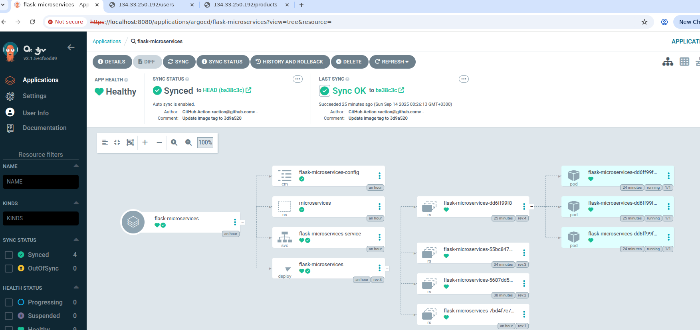
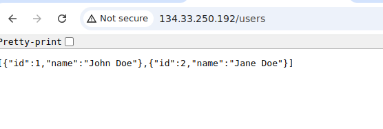
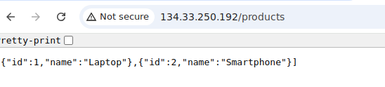

### Guide 

*Disclamer*: this is my first time to use azure

1. terraform:
```bash
cd terraform
terraform init
terraform plan
terraform validate
terraform apply -auto-approve
```

2. login:
```bash
az login
az account set --subscription <id>
az aks get-credentials --resource-group <resource_group> --name <cluster_name> --overwrite-existing
kubelogin convert-kubeconfig -l azurecli
```

3. Dockerfile:
Using the best practices to create the docker file:
- light image
- non root
- health chack

I faced some errors after creating the Dockerfile, first error related to Werkzeug package needed to be added in the requirement file, and second error related run.py didn't take the host from the main correctly, so I had to edit it on the run.py

after testing the app working fine

4. K8s Manifests:
created the necessary manifests for the app exposing it using LB and added argocd manifest for GitOps flow

```bash
helm repo add argo https://argoproj.github.io/argo-helm
helm repo update
helm install argocd argo/argo-cd -n argocd
kubectl -n argocd get secret argocd-initial-admin-secret -o jsonpath="{.data.password}" | base64 -d
kubectl port-forward service/argocd-server -n argocd 8080:443 
```
## 📸 Demo Screenshots
### ArgoCD GitOps Dashboard

### Users

### Products                                       



5. CI/CD:

Created CI/CD for github Actions to build push and edit manifest tag to auto deploy using helm.

6. Monitoring:
Using Promehteus and Grafana helm charts we can make a roubust monitoring system and add azure data source to Grafana to check the metrics and logs from there as well


6. extras:
Please check my other repos for [GCP GKE](https://github.com/Ahmed3sam/devops-sre.git)
and [AWS EKS](https://github.com/Ahmed3sam/reference-kubernetes-platform-series.git)
